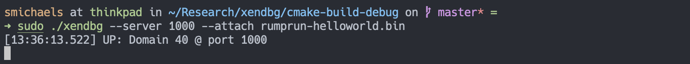
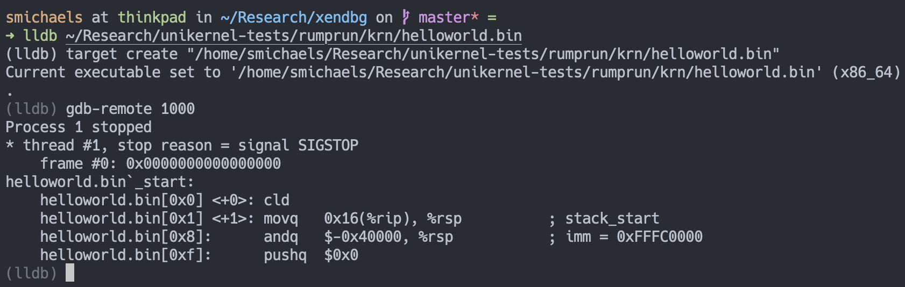

# xendbg - A modern Xen debugger

`xendbg` is a feature-complete reference implementation of a modern Xen VMI debugger,
superseding Xen's own limited and rarely-maintained
[`gdbsx`](https://github.com/mirage/xen/tree/master/tools/debugger/gdbsx).
It can debug both paravirtualized (PV) and hardware virtualized (HVM) guests,
and provides both a standalone REPL and an LLDB server mode.

## Features

* Supports 32- and 64-bit x86 Xen guests, both PV and HVM
* LLDB server mode
* Standalone REPL mode
* Register read/write
* Memory read/write
* Breakpoints
* Watchpoints (HVM only due to Xen API limitations)

## Server mode

When started with `--server`, `xendbg` will start up an LLDB server on the
specified port. A Xen domain may also be specified using the `--attach` option,
which will tell `xendbg` to connect to that domain immediately and close the
connection when it is destroyed. Otherwise, it will open one port per Xen
domain, starting at the given port and counting up. The server will open and
close ports as domains are created and destroyed, and will only exit when the
user explicitly sends a `CTRL-C`.

In either case, LLDB can then connect to any of `xendbg`'s ports using the
`gdb-remote` command, providing the user with a seamless and familiar debugging
experience.





## REPL mode

If started without `--server`, `xendbg` will run a standalone REPL in the
foreground. This mode still provides all of the debugging features that the
LLDB server supports, and some users may prefer it over LLDB's CLI interface.
`xendbg`'s REPL, while somewhat simpler than that of the LLDB CLI, does provide
common CLI debugger comfort features, including tab completion, expressions,
and variables.

Type `help` at the REPL for a full list of commands.

### Features

* **Contextual tab completion:** Hit `<tab>` at any point to list completion
  options; if only one option is available, it will be expanded automatically.
* **Expressions:** Any statements that take numerical values can also take
  expressions, e.g. `disassemble $rip+0x10 0x20`. Besides addition,
  subtraction, multiplication, division, and parenthesization, expressions also
  support:
  * The C-style dereference operator `*`, which will interpret its operand as
    an address in guest memory and read either a 32- or 64-bit value from that
    location, depending on the bitness of the guest.
  * Symbol resolution via the `&` operator.
* **Symbols:** Symbols can be loaded via `symbol load <filename>`, and
  thereafter any valid symbol name prefixed with `&` will evaluate to the
  address of that symbol and can be used in an expression, e.g. `print
  &rumprun_main1`
* **Variables:** Any C-style variable name prefaced with a dollar sign `$` is
  treated as a variable. Variables can be set with `set $my_var = {expression}`
  and unset with `unset $my_var`. In addition, when attached to a guest, its
  registers will be given variable semantics, so they can be read/written
  directly via the `set`/`print` commands, e.g. `set $rax = $rbx + 0x1000`.


## Command line options

```
-h,--help                   Print this help message and exit
-n,--non-stop-mode          Enable non-stop mode (HVM only), making step,
                              continue, breakpoints, etc. only apply to the
                              current thread.
-d,--debug                  Enable debug logging.
-s,--server PORT            Start as an LLDB stub server on the given port.
                              If omitted, xendbg will run as a standalone REPL.
-i,--ip PORT Needs: --server
                            Start the stub server on the given address.
-a,--attach DOMAIN          Attach to a single domain given either its domid
                              or name. If omitted, xendbg will start a server
                              for each domain on sequential ports starting from
                              PORT, adding and removing ports as domains start
                              up and shut down.
```

## Building and installing

### Automatically

Ubuntu users can easily build and install `xendbg` by running `install.sh` in the
root of the project (see also [`build.sh`](./build.sh)). The script will install the
necessary packages, pull and build the third-party dependencies, and finally build
and install `xendbg`.

### Manually

`xendbg` depends on the packages listed below. Exact names may differ on non-Ubuntu
systems; these are from Ubuntu. Note that `xendbg` must be built with `clang` and
`libc++`, as it uses C++17 features for which the `libstdc++` implementations are
known to differ depending on the version of GCC.

```
libcapstone-dev
libspdlog-dev
libxen-dev
libreadline-dev
clang
libc++abi-dev
libc++1
libc++-dev
```

`xendbg` also requires some third-party dependencies that are not available as
Ubuntu packages.

- [CLI11](https://github.com/CLIUtils/CLI11)
- [ELFIO](https://github.com/serge1/ELFIO)
- [uvw](https://github.com/skypjack/uvw)
